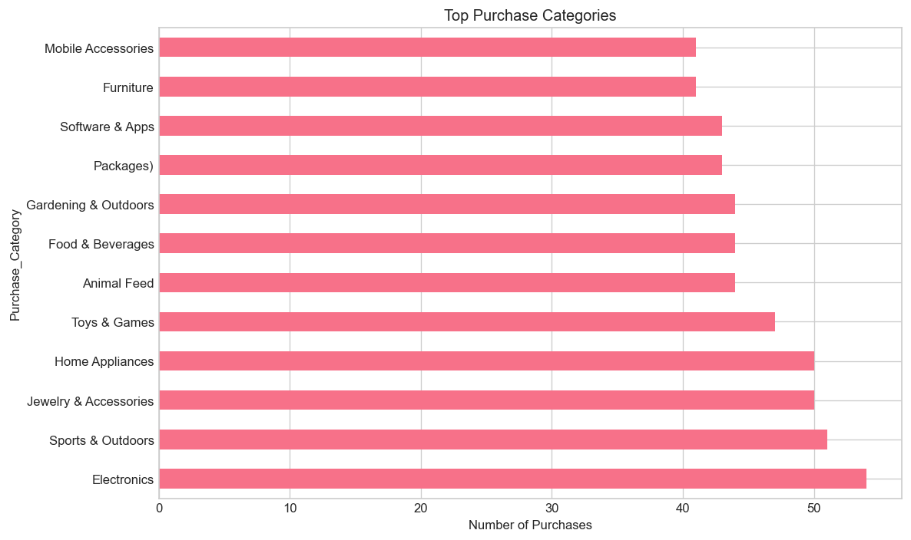
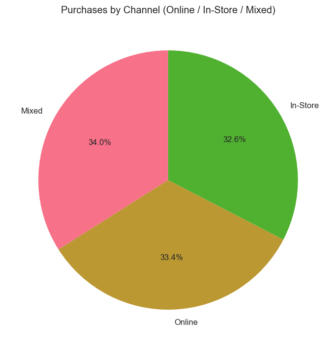
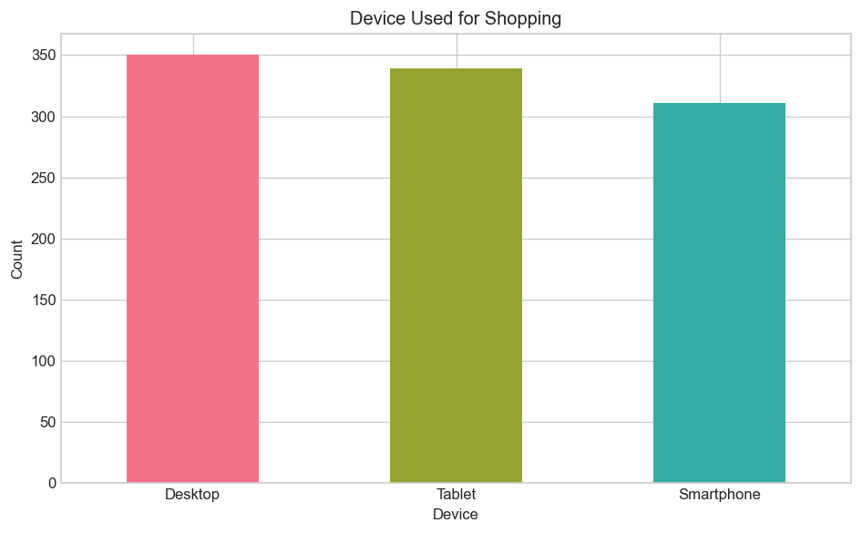
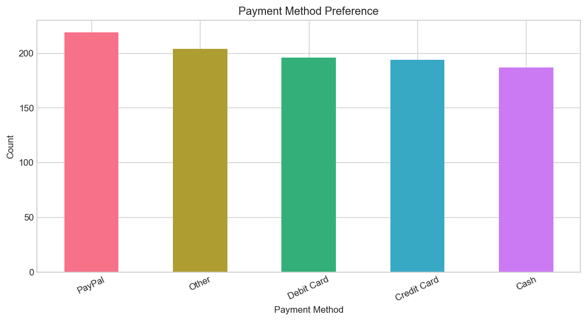
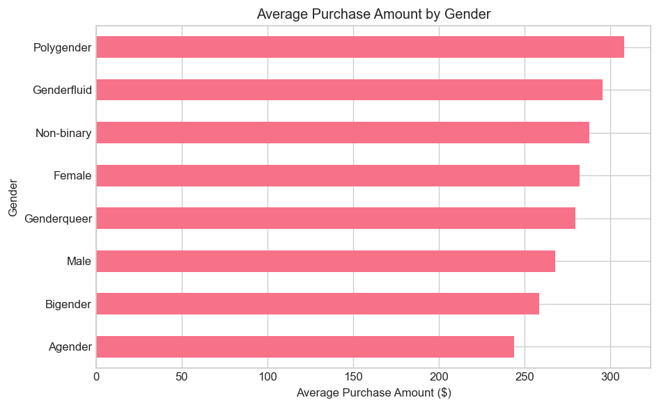
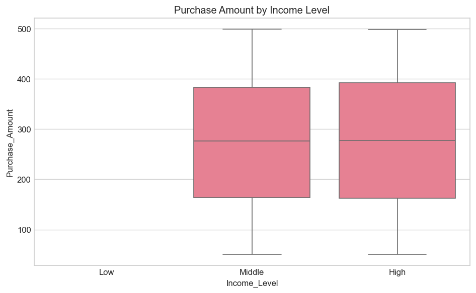
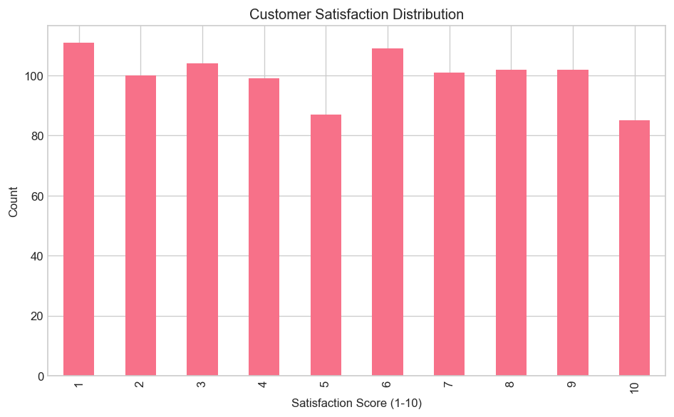
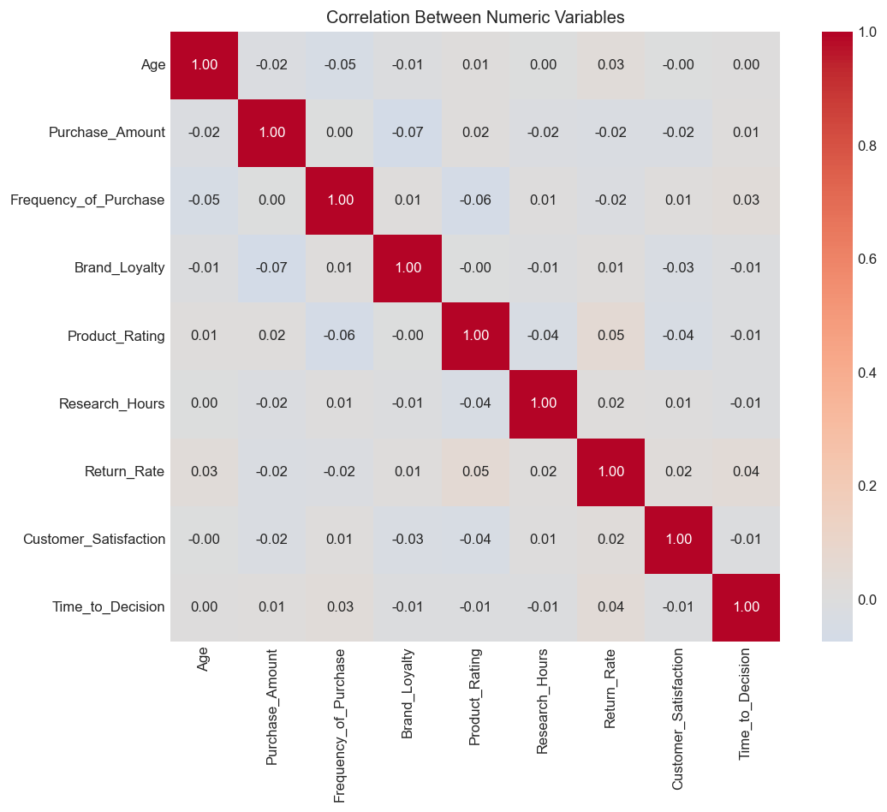
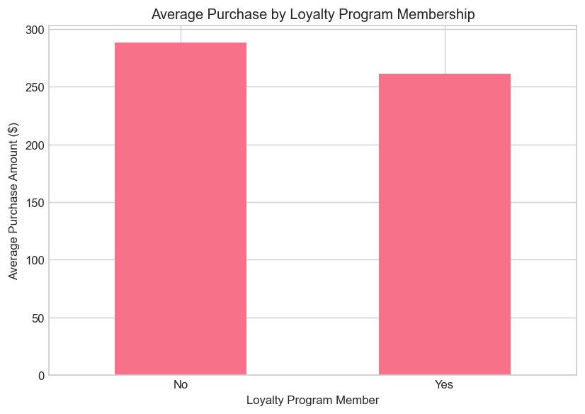

# E-commerce Consumer Behavior Analysis

A data analysis project exploring **e-commerce consumer behavior** using a real-world dataset of customer demographics, purchase patterns, channels, and satisfaction metrics. The repo also includes an **AI Marketing Agent** that uses ML to predict purchase intent and generate personalized marketing emails.

---

## Project overview

This repository contains:

- **Dataset**: `Ecommerce_Consumer_Behavior_Analysis_Data.csv` — consumer behavior records with demographics, purchase details, and satisfaction indicators.
- **Analysis script**: `run_analysis.py` — generates visualizations (requires Python 3.8+, pandas, matplotlib, seaborn).
- **AI Marketing Agent**: ML-driven agent that predicts customer segment, chooses strategy from model confidence, and generates personalized emails (see below).
- **Realtime Analysis agent**: Implemented realtime analysis AI using openai api,that predicts the strategy,confidence percentage.

### Dataset summary

| Aspect | Description |
|--------|--------------|
| **Rows** | ~1,000 customer purchase records |
| **Columns** | 28 (demographics, purchase, channel, satisfaction, etc.) |
| **Use case** | Exploratory analysis, segmentation, reporting, and ML marketing agent |

### Main variables

- **Demographics**: Age, Gender, Income_Level, Marital_Status, Education_Level, Occupation, Location  
- **Purchase**: Purchase_Category, Purchase_Amount, Frequency_of_Purchase, Purchase_Channel  
- **Behavior**: Brand_Loyalty, Product_Rating, Time_Spent_on_Product_Research, Social_Media_Influence, Discount_Sensitivity  
- **Outcomes**: Return_Rate, Customer_Satisfaction, Engagement_with_Ads  
- **Context**: Device_Used_for_Shopping, Payment_Method, Time_of_Purchase, Discount_Used, Customer_Loyalty_Program_Member, Purchase_Intent, Shipping_Preference, Time_to_Decision  

---

## AI Marketing Agent

An intelligent agent that analyzes customer data, predicts **purchase intent** (Need-based, Wants-based, Impulsive, Planned) with a **GradientBoostingClassifier**, and generates personalized marketing emails. Strategy (Upsell / Nurture / Re-engagement) is decided from **prediction probability**, not rule-based segments.

### Agent features

- **Data processing**: Load CSV, clean `Purchase_Amount`, handle missing values, encode categoricals, scale numerics  
- **ML model**: Predicts `Purchase_Intent`; train/test split and accuracy reported  
- **MarketingAIAgent** methods: `preprocess_data()`, `train_model()`, `predict_customer_segment()`, `generate_email()`, `run_agent()`  
- **Decision logic**: High probability → Upsell; Medium → Nurture; Low → Re-engagement  
- **Email generation**: OpenAI API (or context-aware fallback if no API key)  
- **Streamlit UI**: Manual input or sample customers (Loyal / At-risk / New), then run agent and view prediction, strategy, and email  

We also implemented realtime AI agent which analyzes the data and gives the predictions accordingly 


   

## Analyses and visualizations

The following sections describe each analysis and show the corresponding image produced by `run_analysis.py`.

### 1. Distribution of purchase amounts

How much customers spend per transaction. Useful for understanding price sensitivity and basket size.


---

### 2. Top purchase categories

Which product categories are bought most often. Helps focus inventory and marketing.



---

### 3. Purchases by channel

Split between **Online**, **In-Store**, and **Mixed** channels. Shows channel preference.



---

### 4. Device used for shopping

Distribution of devices (e.g. Smartphone, Tablet, Desktop). Informs mobile vs desktop strategy.



---

### 5. Payment method preference

How customers pay (Credit Card, Debit Card, PayPal, Cash, Other). Relevant for checkout and fraud/risk.



---

### 6. Average purchase amount by gender

Comparison of average spend across gender segments.



---

### 7. Purchase amount by income level

Box plot of purchase amount for Low, Middle, and High income. Highlights income-based spending differences.



---

### 8. Customer satisfaction distribution

Distribution of satisfaction scores (e.g. 1–10). Shows overall satisfaction level.



---

### 9. Discount sensitivity

How sensitive customers are to discounts (e.g. Not Sensitive, Somewhat Sensitive, Very Sensitive). Important for promotion design.


---

### 10. Purchase intent

Share of Need-based, Wants-based, Impulsive, and Planned purchases. Useful for messaging and UX.


---

### 11. Correlation heatmap (numeric variables)

Correlations between numeric fields (e.g. Age, Purchase_Amount, Frequency, Brand_Loyalty, Product_Rating, Research time, Return_Rate, Satisfaction, Time_to_Decision). Surfaces relationships for modeling and reporting.



---

### 12. Average purchase by loyalty program membership

Compares average purchase amount for loyalty program members vs non-members. Supports loyalty program ROI discussion.



---

## Repository structure

```
.
├── README.md
├── requirements.txt
├── run_analysis.py
├── Ecommerce_Consumer_Behavior_Analysis_Data.csv
├── .env.example
├── .gitignore
├── config.py
├── marketing_agent.py
├── main.py
├── app.py
└── images/
    ├── ai_marketing_agent_ui.png
    ├── 01_purchase_amount_distribution.png
    ├── 02_purchase_categories.png
    ├── 03_purchase_channel.png
    ├── 04_device_used.png
    ├── 05_payment_method.png
    ├── 06_gender_purchase.png
    ├── 07_income_purchase.png
    ├── 08_satisfaction.png
    ├── 09_discount_sensitivity.png
    ├── 10_purchase_intent.png
    ├── 11_correlation_heatmap.png
    └── 12_loyalty_purchase.png
```

---

## License

This project is for educational and analytical use. Ensure you have the right to use and share the dataset according to its source terms.


